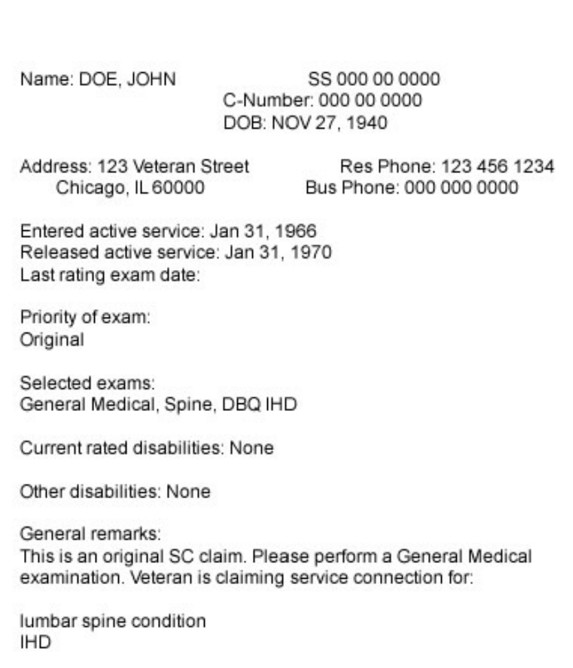

# Performing Disability Exams on Veterans for Court of Law

- The Disability exam is different from a Treatment exam in two ways

1. The purpose of the exam is not to decide a treatment, but to evaluate for disability
2. The audiance of the exam report is not medical professionals, but attorneys, judges, Rating Veterans Service Representatives or Decision Review Officers

- The RSVSR uses record from a physician and then combines with additional information from the recordsand then adjudicates a benifits claim with the schedule of rating disabilities
-  Part 4 of Title 38 of the Code of Federal Regulations, (38 CFR Part 4)


- **Compensation** - Monetary benifits paid to the veterans to compensate average loss of earning potential from service related conditions.

- **Pension** - Monetary benifits for war time veterans who are permanently and totaly disabled from **non-service** connected conditions or a combination of service connected and non-service connected conditions which are not a result of their own willful conduct. 


## The process

- The veteran files a claim with evidence
- The veterans benifits administration conducts an initial review of evidence if the the data is insufficient then a request for examination is sent to a Veterans Health Administration facility or to contract examintion company
- A certified C&P disability examiner then conducts assessments and completes Disability Benifit Questionares per protocol
- A Veterans Benifits Administration's Rating Veterans Service Representative or Decision Review officer including all evidence on the record including any past compensations, this is based on  [38 code Federal regulations Part 4](https://www.law.cornell.edu/cfr/text/38/part-4)
- Then Veterans Benifits Administration notifies the service member in writing of the results


## Request for examination

- Before you perform any examination you will receive a request for examination form. The following information will be available:

```
The veteran's date of service
Priority - original if its the first exam or origin am service connection claim for a condition
```

- Normlly, a general medical exam will only be requested if
1. The veteran makes an original claim for service connection  within the designated time allowed after discharge from the service
2. If the individual claims unemployability due to service-connected conditions
3. If the veteran is claiming pension



## Types of examinations

- **Pension examination** Disease or injury that did not occur during active military service
- **Increase Examination** The veteran claims that the condition has worsened compared the last rating exam, must document time since the last examination
- **Review Examination** VA is required to periodically re-evaluate to dermine whether existing disability rating is still appropriate - detailed history should be obtained
- **Prisoner of War Examination** Approach with greatest sensitivity as these veterans have experienced a great deal of physical and physcological trauma. Examples can inlude beatings, torture, forced marches, forced labor, diet, disease, brainwashing, extremes of hot and cold, psychological abuse and anxiety
- **Terminal Examination** Exam performed on a veteran in a terminal stage
- **Inadequate Examination** When prior exam is insufficient for adjudication purposes

## Chain of appeals
- Appeal the Veteran Benifits Administration
- Board of Veteran Appeals
- US court of appeals for Veterans Claims
- US court of appeals for federal circuit
- Supreme Court

## Diaability claim Key Terms
- **Direct Service Connection**  Disability resulting from personal injury or disease contracted in line of duty - compensations maybe payed if not dishonorably discharged from service

- **Presumption of Soundness** An individual will be presumed to be sound except for defects/disorders noted at the time of entry into service, documents on an individual's DEMO general certification - it can be rebutted by clear and unmistakable evidence demonstrating that an injury or disease existed prior to service

- **Aggravation by Service** When a pre-existing disability becomes permanently worse during service. Natural progression of a pre-existing condition does not qualify for this label

- **Secondary Service Connection** New disability that is connected to a pre-existing service connected disorder

- **Lay Evidence** Any evidence or statements by a person without specialized education. It can be used to describe the onset, serverity, frequency and length of time of any findings 

- **Combat Service** Legal finding of fact pertaining to injuries sustained on a battle field. The veteran will provide proof it can be accepted if the lay evidence is consistent  with the circumstances , conditions and hardships of service. The main important question is whether the current claimed injury is relatd to the combt injury. The VA claims adjudicator will have determined whether a veteran served in a combat


## Exams

- General Medical - usually sifficient for pension claims, claims for individual unemployablity, 
- Spine
- Ischemic Heart Disease
- Disability Benifits Questionare
- Vision, hearing, mental disorder problems and unusually unique problems are usually done by specialists

Most of these exams will have designated worksheets or questionares to be filled out. All negatives are to be documented, additional studies can be requested

## Documentation

**Medical history** points to specify
- injury occurred during, before or after active service
- Any treatment, followup or residuals for the injury
- Document frequency, duration, precipitating and alleviating factors and the resulting impairment
- Surgery and hospitalizations after the service with dates
- Exact diagnosis and date of confirmed dignosis

**Physical Exam**
- Vital signs including height weight and state of nutrition
- Dominant hand
- Posture and possible reason for abnormal gait
- Standard physical exam consisting of head ENT, Neck, CVS, Resp, abdomen, skin/peripheral, GU, Neurological
- Musculoskeletal: measure range of motion using goniometer, pain on motion, 3 repetitions, rest pain, signs of disk disease

**Results of diagnostic and clinical tests**
- X rays, EKG and Echo maybe ordered. Joint X-rays maybe ordered. Especially if there is concern for degenerative or traumatic arthritis.

**Summary**
- All disabilities diagnosed
- Impact of these diagnosis on daily activities and occupation
- **Capacity to manage financial affairs** in his/her own best interest- Does the veteran pay bills himself?
- Assessment whether you think the veteran can take care of his/her finances
- Is social worker service needed?

**Lumbar Spine Exam**
`Pertinent history`
- Dates of trauma if any
- Description of pain related symptoms, use of assistive devices, medications used to relieve pain and their side effects
- Urinary urgency, bowel incontinance, erectile dysfunction
- Functional status- daily activities, occupation, driving
`Physical exam`
- Ankylosis present
- For cervical and thoracolumbar spine: forward flexion, lateral flexion, extension - are these reproducible, any surgery?
- Pain spasm or weaknesses
- Gait, incoordination
- Musculature abnormality, posture
- Muscular atrophy
- Ankle clonous
- Rectal tone

## Disability Medical Assessment for Persian Gulf War General Medical Examination - Service in Southwest Asia Theater operations

- The general principals of performing a compensation and Pension exam are similar to above and are applicable here as well
- **Pattern of Symptoms** : chronic headaches, cognitive difficulties, Widespread bodily pain, unexplained fatigue, chronic diarrhea, skin rashes, respirtory problems
- Compensation & Pension Gulf War Medical Exam is a Legal and Forensic exam
[38 CFR 3.317](https://www.govinfo.gov/content/pkg/CFR-2010-title38-vol1/xml/CFR-2010-title38-vol1-sec3-317.xml) is a useful legal reference to regulations regarding undiagnosed medical conditions
- **Southwest Asia Theater Operations**
- Includes Southwest Asia: Iraq, Saudi Arabia, Bahrain, UAE, Gulf of Aden, Waters of Persian Gulf, Arabian Sea and Red Sea, Kuwait, Qatar, Oman, Gulf of Oman, neutral zone b/w Iraq and Saudi Arabia
- This does not include Afghanistan or Djibouti, but a relevant exam can be performed if there is an associated environmental hazard
- Claims are usually filed within a year, if later then exams can be ordered if 1) There is evidence of current diagnosed disability, 2) Evidence that the veteran was exposed to in service exposure (including lay evidence), 3) Symptoms maybe associated with the in service exposure event

- **Presemptuve Infectious Diseases** Presumed to be connected with Gulf Veterans
- Brucellosis, Compylobacter Jejuni, Coxiella Burnetii (Q fever), Malaria, TB, salmonell-non-typoid, Shigella, Leishania, West Neil virus
- For these infectious diseases listed above, Veterans who went to Afghanistan are eligible for this classifcation

- Chronic fatigue syndrome - pain not relieved by rest
- Fibromyalgia
- Functional GI disorders like irritable bowel, recurrent and unexplained
- Maybe accompanied by abdominal pain, substernal pain, nausea, vomiting, altered bowel
- Chronic multi-system illness with a partially explained etiology
- Systemic exertion intolerance disease (SEID)
- DM and related disease are not considered chronic multi-system


